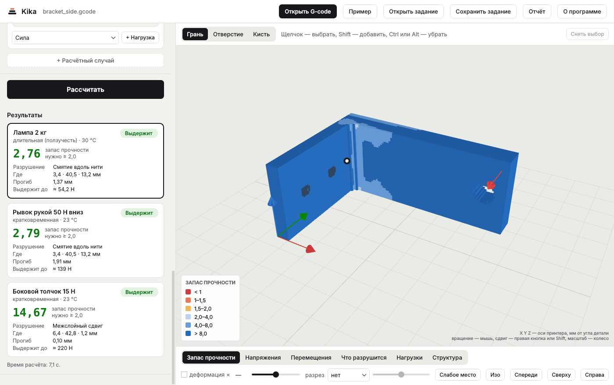
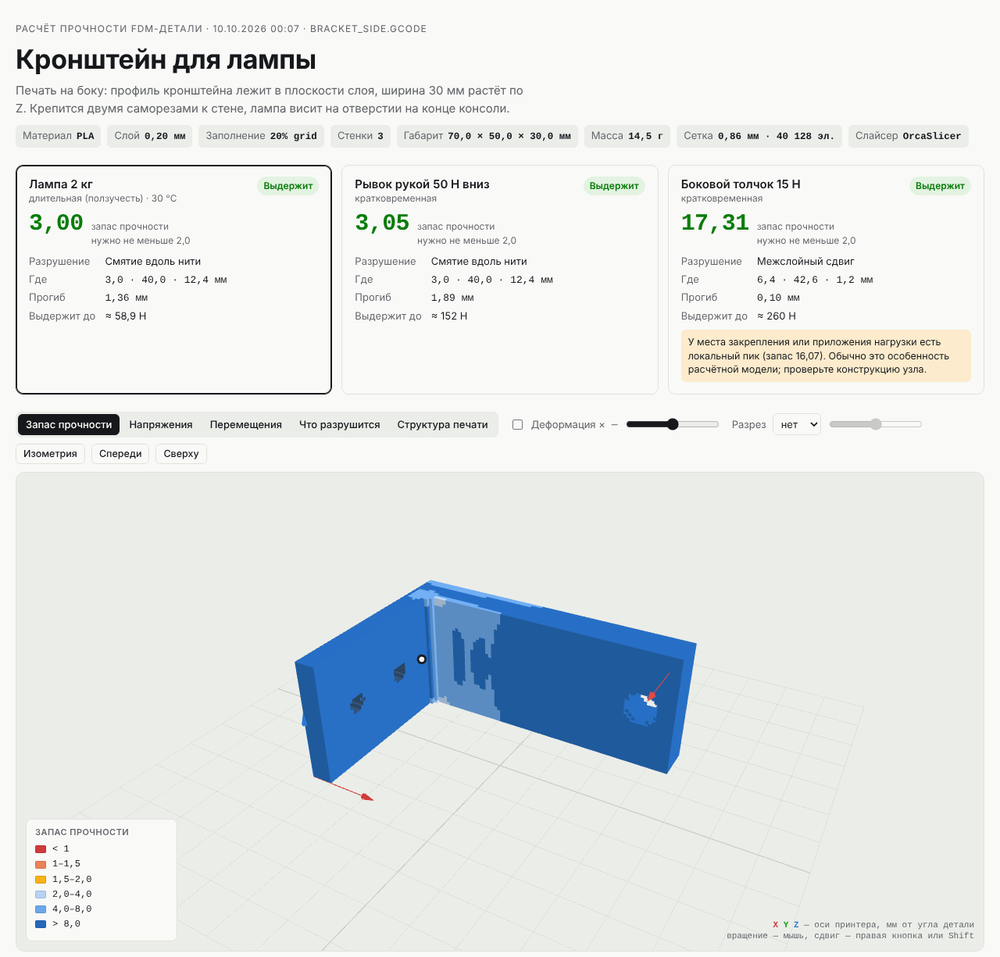

# Kika — расчёт прочности деталей для FDM-печати

Программа отвечает, выдержит ли напечатанная деталь нагрузку. Считает по реальным траекториям сопла из G-code и учитывает главное свойство печатных деталей: вдоль нити пластик прочнее, чем поперёк, а слабее всего — сцепление слоёв.

Ядро переносится с прототипа на Python (папка [`prototype/`](prototype/)) на C++. Каждый перенесённый модуль сверяется с прототипом на одних и тех же файлах. Планы, этапы и сроки — в проектном документе [«САПР для 3D-печати»](https://claude.ai/code/artifact/f01a13ed-8ef5-4a14-8678-5e1580c6a166).

## Что уже работает

| Модуль | Состояние |
| --- | --- |
| Разбор G-code: OrcaSlicer, Bambu Studio, PrusaSlicer, Cura, Simplify3D | перенесён; на всех примерах совпадает с прототипом, работает примерно в 10 раз быстрее |
| Материалы: база из 10 пластиков, анизотропия, критерий Хоффмана | перенесены, совпадают с прототипом |
| Воксельная модель: плотность, направления нитей, роли | перенесена, совпадает с прототипом |
| Метод конечных элементов и решатель | перенесены, совпадают с прототипом; считают на всех ядрах |
| Нагрузки, закрепления, запас прочности, команда `kika run` | перенесены; на кронштейнах, всех видах нагрузок и консольной балке совпадают с прототипом; примерно в 2,5 раза быстрее на 2 ядрах |
| Отчёт с 3D-видом: запас, напряжения, перемещения, вид разрушения, структура печати | перенесён; данные и текст совпадают с отчётом прототипа |
| Окно `kika-gui` на Qt: G-code, закрепления и нагрузки мышью, расчёт в фоне, результаты в 3D, отчёт, задание | готово; повторяет приложение прототипа без браузера и Python |
| Деталь в окне рисуется нитями — валиками по траекториям сопла из G-code, а не кубиками сетки | готово; сетка — по кнопке |
| Модели STL (двоичный и текстовый), 3MF (единицы, преобразования, сборки из компонентов) и STEP (через OpenCascade) | готово; STEP — в программе с окном |
| Свой слайсер: слои, стенки, сплошное и разреженное заполнение (4 рисунка), юбка, G-code для принтера | готово; консольная балка по своему G-code сходится с аналитикой так же, как по слайсеру тестов прототипа |

Порядок переноса и устройство ядра — в [docs/ARCHITECTURE.md](docs/ARCHITECTURE.md).

## Готовая программа без сборки

После каждого изменения GitHub собирает программу под Windows: вкладка **Actions** → последняя сборка с зелёной галочкой → внизу **Artifacts**:

- `kika-gui-windows-x64` — **программа с окном**. Распакуйте архив целиком в любую папку и запустите `kika-gui.exe`. Рядом лежат библиотеки Qt и среды выполнения — они нужны окну; устанавливать ничего не надо. Там же `kika.exe` для командной строки и папка `examples` с примером.
- `kika-windows-x64` — только `kika.exe` (один файл без библиотек) и `kika_tests.exe`. Эта сборка не открывает STEP: для него нужны библиотеки OpenCascade, они есть в папке программы с окном (там `kika.exe` STEP открывает).

**Проще всего — перетащить файл на `kika.exe`.** Файл G-code — откроется окно со сведениями о печати. Файл задания `.json` — программа посчитает прочность детали, сохранит рядом с заданием отчёт и откроет его в браузере. Окно закрывается по Enter. Можно перетащить сразу несколько файлов.

Готовый отчёт по примеру кронштейна лежит в той же сборке, в артефакте `kika-report-example`.

Если Windows покажет «Система Windows защитила ваш компьютер» — программа пока без цифровой подписи: «Подробнее» → «Выполнить в любом случае». Либо до запуска: правый щелчок по `kika.exe` → Свойства → «Разблокировать».

Из командной строки (в папке с `kika.exe` наберите `cmd` в адресной строке Проводника):

```
kika деталь.gcode                         что извлечено из G-code: слайсер, пластик, слои, объём
kika info деталь.gcode --json             то же в JSON
kika run деталь.gcode задание.json        расчёт прочности по заданию и отчёт с 3D-видом
kika run задание.json --open              G-code из задания, отчёт сразу открыть в браузере
kika materials                            встроенная база материалов
kika segments деталь.gcode -o отрезки.csv все отрезки экструзии в CSV
kika info модель.stl                      модель: габарит, объём, замкнута ли поверхность
kika slice модель.3mf --walls 3           нарезать своим слайсером → модель_kika.gcode
kika run задание.json                     задание по модели ("model" вместо "gcode"): нарезка и расчёт
```

## Окно

`kika-gui.exe` делает то же, что приложение прототипа, но без браузера и Python. Откройте G-code или модель (STL, 3MF, STEP) кнопкой «Открыть» или перетащите файл в окно — или нажмите «Пример»: откроется кронштейн с готовым заданием.

Деталь рисуется **нитями** — валиками по траекториям сопла, как в просмотре G-code слайсера: видно стенки, заполнение и слои. Кнопка «Сетка» под 3D-видом показывает расчётную сетку из кубиков.

1. **Деталь** — сведения о печати и детальность сетки (точнее — дольше расчёт). Для модели здесь же **настройки печати**: принтер, слой, стенки, заполнение и его рисунок, сплошные слои, поворот детали на столе на 90° вокруг X, Y или Z. «Нарезать заново» режет модель своим слайсером и строит сетку по новому G-code; выбранные закрепления и нагрузки остаются на своих местах, при повороте поворачиваются вместе с деталью. Если деталь в таком положении не напечатать (висит в воздухе, стоит на ребре), под настройками появится предупреждение. «Сохранить G-code» пишет G-code этой нарезки — его можно печатать (пластик и температуры — из шага «Материал»; стартовый код принтера перед печатью сверьте со своим слайсером).
2. **Материал** — пластик из базы и нужный запас прочности; свойства можно заменить своими числами.
3. **Закрепления** — щёлкните по поверхности, которой деталь крепится, и нажмите «Закрепить выбранное». Над 3D-видом три инструмента: «Грань» — плоская грань целиком, «Отверстие» — стенка отверстия, «Кисть» — всё в радиусе от точки. Shift — добавить к выбору, Ctrl или Alt — убрать, Esc — снять выбор.
4. **Нагрузки** — выберите поверхность, вид нагрузки и нажмите «+ Нагрузка». Расчётных случаев может быть несколько, каждый считается отдельно.

«Рассчитать» — расчёт идёт в фоне, окно не замирает. Справа — запас прочности, напряжения, перемещения (можно показать деформацию), что разрушится первым; разрез по любой оси и кнопка «Слабое место». «Отчёт» сохраняет тот же HTML-отчёт, что `kika run`, и открывает его в браузере. «Сохранить задание» пишет файл в формате `kika run`: его можно открыть в окне снова или посчитать из командной строки. Открываются и задания из примеров (поверхности заданы геометрически: сторона, отверстие, параллелепипед), и задания, сохранённые приложением прототипа. Задание по модели сохраняется с моделью и настройками печати (`"model"`, `"print"`) — в окне и в `kika run` деталь нарежется так же.



Если окно не открывается или 3D-вид пустой (нет драйвера видеокарты, удалённый рабочий стол, виртуальная машина), запустите `kika-gui-software.cmd` из той же папки — он включает программный OpenGL.

## Расчёт прочности

Что посчитать, описывает файл задания: материал, закрепления и нагрузки. Готовые примеры — `prototype/examples/bracket_side.job.json` и `bracket_upright.job.json` (кронштейн лампы, напечатанный на боку и стоя) и [`examples/bracket_L.job.json`](examples/) — уголок из модели 3MF, который нарезает свой слайсер. Формат со всеми видами нагрузок и способами выбрать поверхность — в [docs/JOB_FORMAT.md](docs/JOB_FORMAT.md).

```
> kika run prototype\examples\bracket_side.job.json
G-code: C:\project_kika\prototype\examples\bracket_side.gcode
  слайсер OrcaSlicer, пластик PLA, слой 0.2 мм, заполнение 20% grid, габарит [69.96, 49.96, 30.0] мм
  сетка: воксель 0.568 мм, 117119 элементов, 130916 узлов
…
Материал: PLA   требуемый запас: 2

▶ Лампа 2 кг  [длительная (ползучесть)]
   Итог: ВЫДЕРЖИТ   запас прочности 2.55  (в точке [3.7, 40.59, 13.5] мм)
   Вид разрушения: Смятие вдоль нити
   Наибольшее перемещение: 1.413 мм
   Предельная сила на отверстие ≈ 50,1 Н
```

Кроме текста в окне, `kika run` сохраняет **отчёт** — один HTML-файл рядом с заданием (`bracket_side_отчёт.html`). Он открывается в любом браузере без установки и без интернета: карточки расчётных случаев и 3D-модель, которую можно вращать, раскрашенная по запасу прочности, напряжениям, перемещениям, виду разрушения или структуре печати (стенки, сплошное и разреженное заполнение); есть разрез и показ деформации. Отчёт можно переслать: всё нужное внутри.



Параметры: `-o отчёт.html` — куда записать отчёт, `--open` — открыть его в браузере, `--no-report` — без отчёта, `--voxel 0.5` — размер вокселя в мм, `--max-elems 150000` — предел числа элементов (меньше — быстрее и грубее), `--threads 4` — число потоков (по умолчанию все ядра), `--json итоги.json` — итоги в JSON, `--quiet` — без строк хода расчёта.

## Сборка на Windows

Нужны Git и Visual Studio Community с набором «Разработка классических приложений на C++». В нём уже есть компилятор, CMake, Ninja и vcpkg. Библиотеки при первой настройке скачиваются сами, это занимает несколько минут.

**В Visual Studio.** Файл → Открыть → Папка → папка проекта. Студия найдёт `CMakePresets.json`. В списке конфигураций вверху выберите «Windows x64 — Release», затем Сборка → Собрать все. Тесты — Тест → Обозреватель тестов.

**В командной строке.** Откройте «Developer PowerShell for VS» (обычный PowerShell не подойдёт: в нём нет компилятора и vcpkg):

```
git clone https://github.com/Demid-dclxvi/project_kika
cd project_kika
cmake --preset win-release
cmake --build --preset win-release
ctest --preset win-release
build\win-release\bin\kika.exe info prototype\examples\bracket_side.gcode
```

Если `cmake` пишет, что не найден `vcpkg.cmake`, значит не задана переменная `VCPKG_ROOT`. Поставьте vcpkg отдельно:

```
git clone https://github.com/microsoft/vcpkg C:\vcpkg
C:\vcpkg\bootstrap-vcpkg.bat
setx VCPKG_ROOT C:\vcpkg
```

и откройте новое окно Developer PowerShell.

**Окно (kika-gui).** Нужен Qt 6.8 для MSVC — бесплатная версия под LGPL. Проще всего поставить его через aqtinstall (без учётной записи Qt):

```
python -m pip install aqtinstall
python -m aqt install-qt windows desktop 6.8.3 win64_msvc2022_64 -O C:\Qt
setx QT_ROOT_DIR C:\Qt\6.8.3\msvc2022_64
```

(или установщиком Qt: Qt 6.8 → «MSVC 2022 64-bit», остальные компоненты не нужны). Откройте новое окно Developer PowerShell или перезапустите Visual Studio и выберите конфигурацию «Windows x64 с окном (Qt) — Release»:

```
cmake --preset win-gui-release
cmake --build --preset win-gui-release
C:\Qt\6.8.3\msvc2022_64\bin\windeployqt build\win-gui-release\bin\kika-gui.exe
build\win-gui-release\bin\kika-gui.exe
```

Первая настройка этой конфигурации долгая: vcpkg собирает OpenCascade для чтения STEP (это может занять час), дальше берёт его из своего кэша. `windeployqt` кладёт библиотеки Qt рядом с программой — без них окно не запустится (или добавьте `C:\Qt\6.8.3\msvc2022_64\bin` в PATH). Окно собирается отдельной конфигурацией: Qt подключается библиотеками DLL, поэтому и среда выполнения C++ там в DLL, а `kika.exe` из обычной конфигурации — один файл без библиотек. Тесты — в обычной конфигурации.

## Сверка с прототипом

```
python -m pip install numpy scipy
python tools/compare_with_prototype.py --kika build\win-release\bin\kika.exe
```

Скрипт разбирает примеры прототипа и синтетические случаи обеими версиями и сравнивает каждый отрезок, затем считает задания кронштейнов, все виды нагрузок и консольную балку и сравнивает итоги, воксели и поля напряжений. В CI это делается автоматически на Linux. `--skip-analysis` — только разбор G-code (тогда scipy не нужен).

## Структура

```
src/core/      ядро — библиотека без интерфейса (kika_core)
src/report/    HTML-отчёт с 3D-видом (kika_report); web/ — просмотрщик и three.js
src/geometry/  модели: треугольная сетка, STL, 3MF (ZIP и XML свои), STEP через OpenCascade (kika_geometry)
src/slicer/    свой слайсер: модель → слои → G-code (kika_slicer, Clipper2)
src/app/       логика окна без Qt: сцена, нити, выбор граней, задание из окна (kika_app)
apps/cli/      консольная программа kika
apps/gui/      окно kika-gui на Qt: панель задания и 3D-вид на OpenGL
packaging/     файлы для папки с программой (Windows)
tests/         тесты (Catch2); tests/data — G-code для тестов
examples/      примеры моделей и заданий (примеры по G-code — в prototype/examples)
docs/          устройство ядра, формат задания
tools/         вспомогательные скрипты
prototype/     прототип на Python — эталон для сверки, не изменяется
```

## Лицензии

Код проекта принадлежит автору. Сторонние библиотеки и их лицензии — в [THIRD_PARTY.md](THIRD_PARTY.md). Библиотеки под AGPL в продукт не входят.
